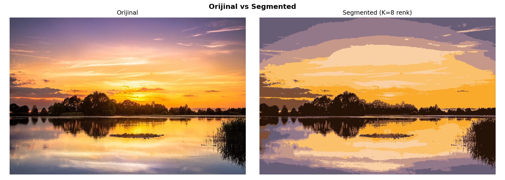
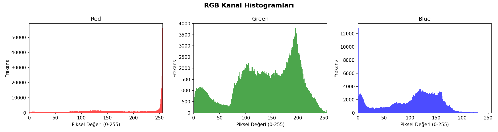
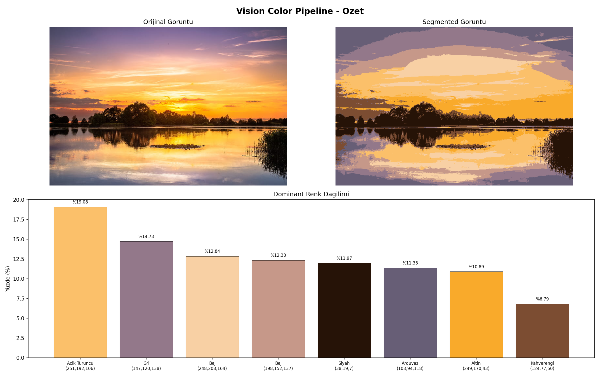

# Vision Color Pipeline

A modular image processing pipeline that breaks down a photograph into its fundamental components — pixels, colors, and regions. Load any image and watch it transform from millions of colors into a clean, segmented poster with named dominant colors.

Built as a foundational exercise for an upcoming **Paint by Numbers** project.

## What It Does

```
Input Image → Pixel Analysis → Histogram → K-Means Clustering → Segmentation → Color Naming → Visual Output
```

1. **Load** a photograph and inspect it as a raw number matrix
2. **Analyze** pixel distributions through RGB histograms
3. **Cluster** millions of colors into K dominant groups using K-Means
4. **Segment** the image — each pixel gets replaced by its cluster center color
5. **Name** each color using perceptual distance in CIE LAB color space
6. **Visualize** everything: palette, side-by-side comparison, and a summary panel

## Results

### Original vs Segmented

The image is reduced from millions of colors down to just **K = 8** dominant colors:



### Dominant Color Palette

Each cluster center is named using nearest-neighbor lookup in **CIE LAB** color space:


### RGB Histograms

Per-channel pixel intensity distributions reveal the color profile of the image:



### Full Summary

A single dashboard combining the original image, segmented output, and color distribution:



## Project Structure

```
vision-color-pipeline/
├── data/
│   └── sample.jpg                # Input image
├── src/
│   ├── image_io.py               # Load & save with BGR/RGB conversion
│   ├── pixel_analysis.py         # Flatten image to pixel matrix
│   ├── histogram.py              # RGB channel histograms
│   ├── clustering.py             # K-Means color quantization
│   ├── segmentation.py           # Map pixels to cluster centers
│   ├── color_categorization.py   # LAB-based nearest color naming
│   └── visualization.py          # Palette, comparison & summary charts
├── outputs/                      # Generated visuals
├── main.py                       # Pipeline orchestration (controller)
├── config.py                     # All constants in one place
└── requirements.txt              # Dependencies
```

## Getting Started

```bash
# Create and activate virtual environment
python -m venv .venv
.\.venv\Scripts\Activate          # Windows
source .venv/bin/activate         # macOS / Linux

# Install dependencies
pip install -r requirements.txt
```

## Usage

Place an image in `data/` (default: `sample.jpg`), then:

```bash
python main.py
```

All outputs are saved to `outputs/`.

## Configuration

Everything is controlled from `config.py` — no magic numbers in the codebase:

```python
IMAGE_PATH   = "data/sample.jpg"   # Input image path
OUTPUT_DIR   = "outputs/"          # Output directory
K_CLUSTERS   = 8                   # Number of color clusters
RANDOM_STATE = 42                  # Seed for reproducibility
```

## Tech Stack

| Library | Role |
|---------|------|
| **OpenCV** | Image I/O, color space conversions (BGR / RGB / LAB) |
| **NumPy** | Pixel matrix operations |
| **scikit-learn** | K-Means clustering algorithm |
| **Matplotlib** | Histograms, palettes, and comparison charts |

## Design Principles

- **Single Responsibility** — each module does one thing well
- **Controller / Logic separation** — `main.py` orchestrates, `src/` computes
- **No magic numbers** — all constants live in `config.py`
- **Type hints & docstrings** — every function is documented and typed
- **LAB perceptual color naming** — colors are named by nearest-neighbor lookup in LAB space, not brittle HSV thresholds

## Contact

**Busra Kurun**

- Email: [busrakurunceng@gmail.com](mailto:busrakurunceng@gmail.com)
- LinkedIn: [linkedin.com/in/büşra-kurun](https://www.linkedin.com/in/b%C3%BC%C5%9Fra-kurun)

Feel free to reach out for questions, feedback, or collaboration.
